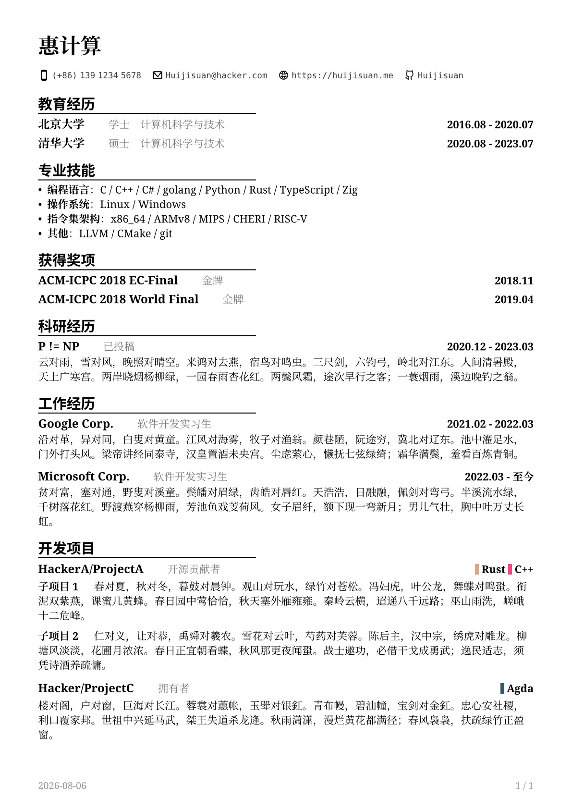
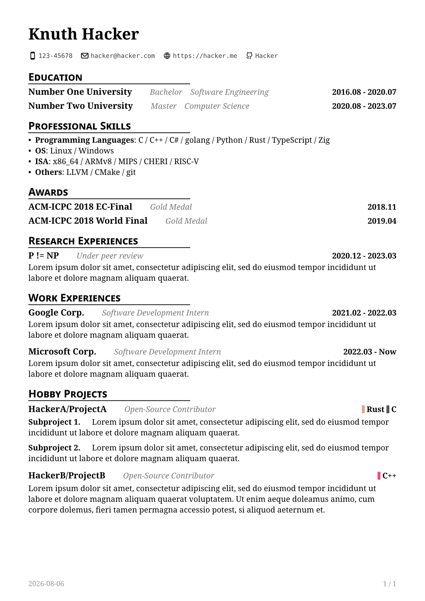

# Resume Template

A compact, single-column resume template for software developers, written in [Typst](https://typst.app/). It provides semantic helpers for common resume entries, English and Simplified Chinese locales, configurable typography, and clickable contact details.

| Simplified Chinese | English |
| --- | --- |
| [](example_zh-cn.typ) | [](example_en-us.typ) |

## Requirements

The template is tested with Typst 0.15.1. Install Typst before compiling the template and use `typst fonts` to check which fonts Typst can find.

The default `adobe-source` font set uses Source Serif 4, Source Han Serif, Source Sans 3, Source Han Sans, and Source Code Pro. If those families are not installed, install them or select the built-in `noto` font set. See [Fonts](docs/tutorial.md#fonts) for details.

## Quick start

Download and extract the source archive for [v0.3.0](https://github.com/Lancern/resume-template/releases/tag/v0.3.0), or clone the tagged source:

```bash
git clone --branch v0.3.0 --depth 1 https://github.com/Lancern/resume-template.git
cd resume-template
```

Keep `resume.typ`, `src/`, and `resources/` together. Create `my-resume.typ` in the project directory:

```typst
#import "resume.typ": career, edu, resume

#show: resume.with(
  "Taylor Hacker",
  "+1 555 010 1234",
  "taylor@example.com",
  webpage: "https://example.com",
  github-id: "taylor",
  locale: "en-us",
)

= Education
#edu(
  "Example University",
  "BSc",
  "2018.09",
  end-date: "2022.06",
  major: "Computer Science",
)

= Experience
#career(
  "Example Corp.",
  "Software Engineer",
  "2022.07",
)[
  Built reliable systems and improved developer tooling.
]
```

Compile it with:

```bash
typst compile my-resume.typ
```

During editing, `typst watch my-resume.typ` recompiles the PDF whenever the source changes.

## Documentation

- [Tutorial](docs/tutorial.md) — build a complete resume and customize its locale, layout, footer, and fonts.
- [API reference](docs/api-reference.md) — signatures, defaults, behavior, and examples for every public definition.
- [English example](example_en-us.typ) and [Simplified Chinese example](example_zh-cn.typ) — complete sources that are compiled in CI.

## Contributing

Bug reports, fixes, features, and documentation improvements are more than welcome. Open an [issue](https://github.com/Lancern/resume-template/issues) or submit a pull request. When changing layout or behavior, compile both example documents before submitting the change:

```bash
typst compile -f png example_en-us.typ resources/example_en-us.png
typst compile -f png example_zh-cn.typ resources/example_zh-cn.png
```

## License

This project is released under the [Creative Commons Zero v1.0 Universal](LICENSE) license.
