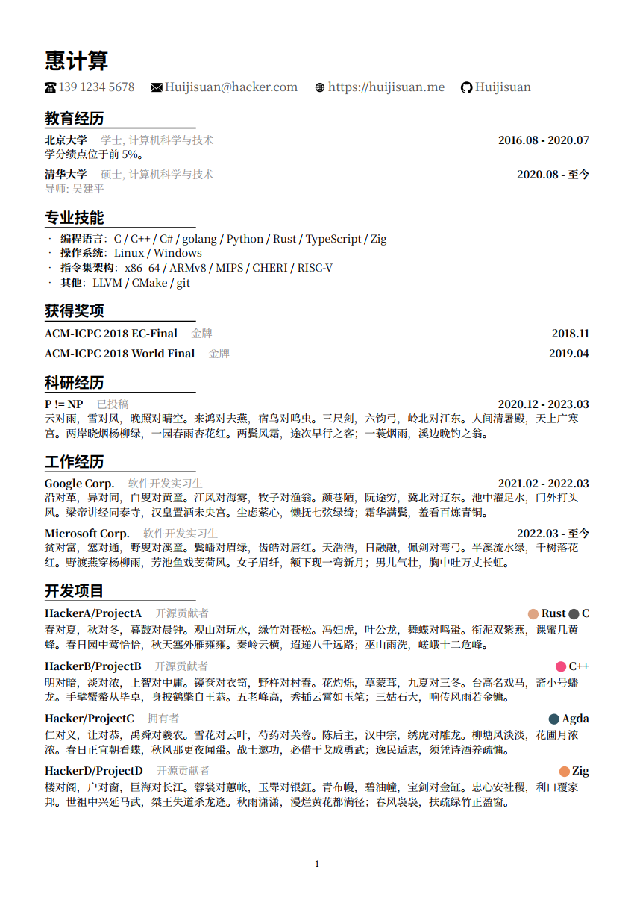

# resume

This repository contains a simple resume template written in [typst].

<div style="display:flex;">
  
  
</div>

## Usage and Build

You need to install [typst] before you start.

The file `resume.typ` contains the template definition, which defines the resume's layout and provides some useful utility functions to help typeset your resume.
You can import this file into your own typst file to use the template:

```typst
#import "resume.typ": *

#show: resume.with(
  "Your name",
  "Your phone number",
  "Your email",
  webpage: "https://your.home.page",
  github-id: "YourGithubId",
  photo: image("figures/photo.png"),  // Your personal photograph
  lang: "en",
)

= Education
// Your education experiences

= Professional Skills
// Your professional skills

= Work Experiences
// Your work experiences

// And more
```

This repository provides two examples that you can directly modify and refer:

- `main-en.typ`: A resume example written in English;
- `main-cn.typ`: A resume example written in simplified Chinese.

To build the resume, execute:

```bash
typst compile main.typ
```

Where `main.typ` is the file name of your typst source file.

## Reference

This section lists all the public functions and their usages as defined in `resume.typ`.
This section may require basic knowledge about the [typst language](https://typst.app/docs/reference/).

> TODO: This section is still incomplete.

### `resume.typ: resume` Function

This function defines the resume template.

Synopsis:

```typst
#let resume(
  name,
  phone,
  email,
  webpage: none,
  github-id: none,
  twitter-id: none,
  photo: none,
  lang: "en",
  body,
) = { /* ... */ }
```

Parameters:

- `name`: `string`. Your name.
- `phone`: `string`. Your phone number.
- `email`: `string`. Your email number.
- `webpage`: `string`, optional. URL to your home page.
- `github-id`: `string`, optional. Your GitHub ID. A link to your github profile page will be automatically generated.
- `twitter-id`: `string`, optional. Your Twitter ID. A link to your twitter profile page will be automatically generated.
- `lang`: `string`, optional, default: `en`. The resume's language.
- `body`: `content`, required. The main content of the resume.

Returns: `content`, the content to be displayed in the output.

### `resume-item` Function

> TODO: documentation is incomplete

### `edu-item` Function

> TODO: documentation is incomplete

### `award-item` Function

> TODO: documentation is incomplete

### `work-item` Function

> TODO: documentation is incomplete

### `develop-item` Function

> TODO: documentation is incomplete

## Contribution

Any kinds of contributions are welcomed, including bug reports, bug fixes, features requests, feature implementations, documentation improvements, etc.
Feel free to open a new issue or PR!
If you have any questions on the usage of this template, feel free to open a new issue.

## License

This repository is open-source under the [Creative Commons Zero v1.0 Universal (CC0-1.0)](./LICENSE) license.

[typst]: (https://typst.app/)
